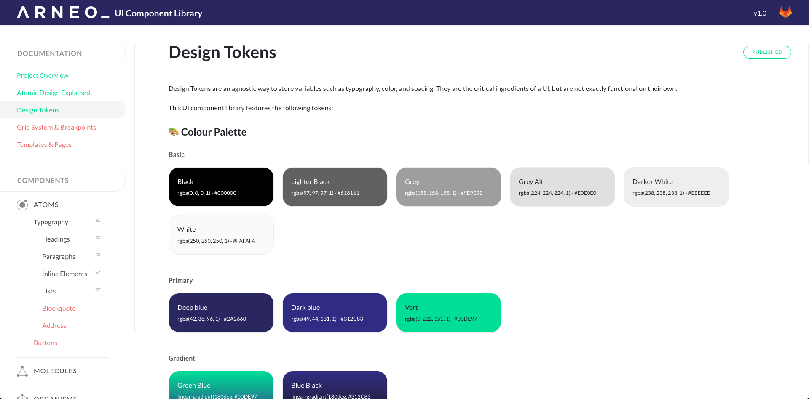

# Starter Fractal

An awesome starter point for your Fractal UI component library.

[Fractal](https://fractal.build/) is a fantastic tool for building, maintaining and cataloging the various components used to construct a design system, website or software project.

This starting point has been developed to adhere to the principles of [Atomic Design](http://bradfrost.com/blog/post/atomic-web-design/), containing Atoms, Molecules, Organisms, Templates and Pages for you to style & use 'out of the box' as well as aid you in defining your own components. Some skeleton documentation pages have been added too.

Keep what you need, delete what you don't and add whatever you like on top of whats already there.



## Installing

1. Run ```npm install```
2. Configure your styleguide and project

## Configuration

* For the Fractal styleguide : ```fractal.config.js``` 
    > Every variables are explained in it
* For the project : ```webpack.config.js```
    > If you want to change paths for assets compilations - or custom your webpack config

## Running Front

```Shell
npm run dev
```

In `webpack.config.js` file :
```
new FractalWebpackPlugin({
    mode: 'server', // mode: 'build'
})
```

- `mode: 'server'` : The command will starts up a Fractal development server with BrowserSync on [`localhost:3000`](http://localhost:3000).
- `mode: 'build'` : The command will package up your complete Fractal styleguide and convert it to a **standalone publishable site in HTML**.

## Directories Explained

* ```build/``` - publishable HTML version of complete Fractal library 
* ```components/``` - Fractal library 'building block' components structured using Atomic Design principles. Go [here](https://fractal.build/guide/components/) to find out more about components.
* ```dist/``` - directory containing all compiled styling, scripts and other 'production ready' frontend resources ready to be distributed/published
* ```docs/``` - Fractal library documentation pages in markdown format. Go [here](https://fractal.build/guide/documentation/) to find out more about documentation.
* ```src/``` - directory containing Sass and JavaScript files to be compiled into the appropriate folders in the 'dist' directory.
  * ```font/``` - fonts
  * ```img/``` - static images
  * ```js/``` - JavaScript files
  * ```scss/``` - SCSS files
  * ```webui-overrides/``` - markup and styles used to override Fractal's Mono theme
  * ```AnythingYouNeed/``` - Add the doc
  * ...

## Working with Components

```_preview.twig``` file is the basis file for the Fractal styleguide, so you need to :
- [ ] Enter an appropriate ```PROJECT NAME``` in the ```<title>``` element
- [ ] Link to your stylesheets & scripts if you changed the paths in `webpack.config.js`.

## Let's go 🎉 !

Then you can start to design your Fractal Styleguide by following the doc on the left side panel...
